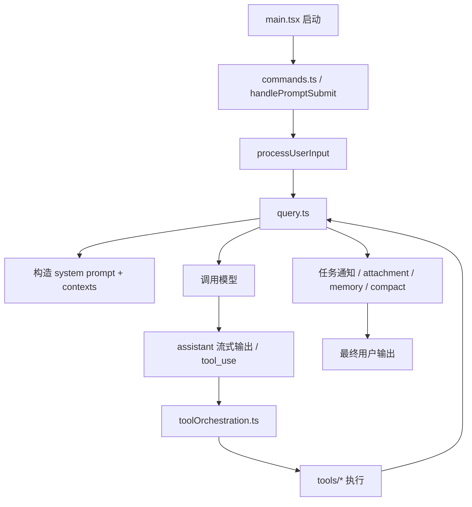

# 01. 项目架构分析

[返回总览](../README.md) | [提示词工程](../02-prompt-engineering/README.md) | [Agent 引擎](../03-orchestration-agent-engine/README.md)

## 一句话理解

Claude Code 是一个“终端形态的 agent runtime”。UI、命令、工具、任务、记忆、MCP、远程会话都围绕同一个查询循环组装。

## 分层结构

1. 启动层
   `src/main.tsx` 负责 CLI 参数、启动预热、配置加载、插件与技能初始化、MCP 连接预取、渲染入口。
2. 交互层
   `src/commands.ts` 注册 `/command`，`src/utils/handlePromptSubmit.ts` 与 `src/utils/processUserInput/processUserInput.ts` 处理用户输入、slash command、附件与桥接消息。
3. 推理执行层
   `src/query.ts` 是核心状态机，负责模型调用、工具循环、错误恢复、压缩、附件注入、turn continuation。
4. 工具层
   `src/Tool.ts` 定义工具协议，`src/tools.ts` 聚合工具，具体能力在 `src/tools/*`。
5. 任务层
   `src/tasks/*` 管理本地 agent、远程 agent、主线程后台化、队友任务等生命周期。
6. 服务层
   `src/services/*` 提供 API、压缩、MCP、LSP、memory、analytics、plugins、tips 等横切能力。
7. 扩展与远程层
   `src/bridge/*`、`src/remote/*`、`src/skills/*`、`src/services/mcp/*` 把本地 runtime 扩展成 IDE/远程/插件/技能生态。

## 主链路

## 架构特征

## 1. 启动时并行预热

`src/main.tsx` 在顶层副作用里预热 MDM、Keychain、GrowthBook 等，目标是缩短首轮可用时间。

## 2. 特性大量受 feature flag 控制

`bun:bundle` 的 `feature()` 被广泛用于编译时裁剪，如 coordinator mode、bridge、voice、cron、context collapse、reactive compact、workflow 等。

## 3. 运行时上下文集中在 `ToolUseContext`

`ToolUseContext` 不只是工具参数，还承载：

- 当前消息流
- AppState 访问
- abort controller
- file state cache
- prompt / tool / model 选项
- agent 身份
- 通知、UI、SDK 状态回调

这意味着“工具执行”和“会话状态”并不是分离的，而是同一个 runtime context。

## 4. Command、Tool、Task 三套模型协作

- Command 解决“如何进入某个能力”
- Tool 解决“模型如何执行具体动作”
- Task 解决“长期/后台/异步工作如何存活与回传结果”

这三者的边界是本项目最重要的设计之一，详见 [03 任务编排、提示词编排与 Agent 引擎](../03-orchestration-agent-engine/README.md)。

## 架构上的关键文件

- `src/main.tsx`: 启动、配置、模式切换、初始化总入口
- `src/query.ts`: 真正的 agent loop
- `src/constants/prompts.ts`: 系统提示总装配
- `src/services/tools/toolOrchestration.ts`: 工具并发/串行策略
- `src/tasks/LocalAgentTask/LocalAgentTask.tsx`: 本地 agent 任务状态
- `src/tools/AgentTool/runAgent.ts`: 子代理执行入口

## 我对这个架构的判断

- 它不是简单把 LLM 包一层 CLI，而是把“prompt、tool、memory、task、scheduler、permissions”全部收敛到一个统一 runtime。
- 复杂度最高的部分不是 UI，而是“如何让一个多回合、多工具、多任务的 agent 持续安全运行”。
- 因为很多功能都以 `query.ts` 为中心，所以阅读源码时应该优先理解 query loop，再回头看命令、任务和扩展层。
